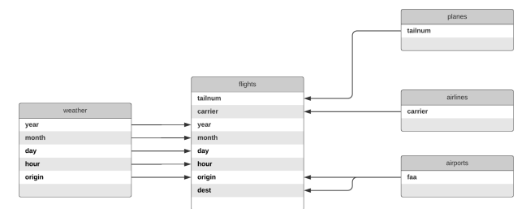

# Laboratorio 2

## Descripción

En este laboratorio usaremos los datos de todos los vuelos que partieron de Nueva York en 2013. Estos datos se encuentran disponibles en el paquete **nycflights13** de R. Los datos no solo incluyen información de vuelos sino también de aviones, aeropuertos, aerolíneas y el clima de vuelo.

A continuación se describen los datasets que se incluyen en este paquete:

-   **flights**: Contiene información sobre todos los vuelos que salen de Nueva York.

-   **airports**: Ofrece información sobre los aeropuertos, es decir: el nombre y la ubicación.

-   **planes**: Contiene información sobre aviones particulares utilizados en vuelos.

-   **airlines**: Brinda información sobre aerolíneas.

-   **weather**: Nos da las condiciones climáticas en la ciudad/aeropuerto de salida en Nueva York.

Desarrollo del laboratorio

-   Importe el paquete nycflights13 en su cuaderno de trabajo.

```{r}
install.packages("nycflights13")
library(nycflights13)
```

-   Explore el contenido de cada dataset con la función *View( )*.

```{r}
View(flights)
View(airports)
View(planes)
View(airlines)
View(weather)
```

# 1. Inner-join

```{r}
library("dplyr")
```

## 1.1 Conecte *fligths* con *planes*

```{r}
flights %>%
  inner_join(planes, by="tailnum", suffix=c("_flights", "_planes"))
```

## 1.2 Conecte *flights* con *airlines*

```{r}
flights %>%
  inner_join(airlines, by="carrier")
```

## 1.3 Conecte *flights* con *airparts* (según el esquema de arriba existe una doble relación de *airpoarts* hacia *flights*

```{r}
flights %>%
  inner_join(airports, by=c("origin"="faa")) %>%
  inner_join(airports, by=c("dest"="faa"), suffix=c("_origin", "_dest"))

```

## 1.4 Conecte *flights* con *weather* (según esquema de arriba, hay 5 variables que relacionan a ambas tablas)

```{r}
flights %>%
  inner_join(weather, by=c("year","month", "day", "hour", "origin"))
```

# 2 Data manipulation

## 2.1 Utilize el verbo *count* en *fligths* y envíe como parámetro las variables *year*, *month*, *day*. Luego filtre *n* para que sea mayor a 1000. Por último ordene *n* con el vergo *arrange* y devuelva el resultado.

```{r}
flights %>%
  count(year, month, day) %>%
  arrange(n > 1000)
```

## 2.2 Utilice el concepto de slección por rango (aplicando el operado ":") para obtener las variables *year* hacia *day*. También agregue a esta selección *hour*, *origin*, *dest*, *tailnum*, *carrier*, *arr_delay*, *dep_delay*, por último almacene el resultado en la variable *flights_selected*.

```{r}
flights_selected <- flights %>%
  select(year:day, hour, origin, dest, tailnum, carrier, arr_delay, dep_delay)
```

## 2.3 Utilice *left_join* para combinar *airlines* y *flights_selected*. Al obtener el resutlado utilice el verbo *select* para eliminar las columnas *origin* y *dest* (utilice el operador "-" para descartar estas columnas únicamente). Por último agregue una nueva columna con el verbo *mutate*, asigne el nombre *tot_delay* y opere la suma de *arr_delay* y *dep_delay.*

```{r}
airlines %>%
  left_join(flights_selected, by="carrier") %>%
  select(-origin, -dest) %>%
  mutate(tot_delay = sum(arr_delay, dep_delay))
```

## 2.4 Utilice *inner_join* para combinar *flights* y *weather*, luego agrupe por la variable *precip*. Utilice summarize para encontrar el promedio de la variable *dep_delay* (aplicando la función mean), asigne al promedio el nombre *delay*. Al utilizar la función mean agregue el parámetro *na.rm* y asígnele *TRUE* por defecto. A continuación un ejemplo:

`mean(variables, na.rm = TRUE)`

Esta expresión simplemente indica a R que si encuentra valores perdidos en la variable los elimine.

Luego agregue la función replace_na y aplíquelo a la variable delay sustituyendo NA por cero. Por último almacene el resultado en la variable precip_delay.

```{r}
library(tidyr)
```

```{r}
precip_delay <- flights %>%
  inner_join(weather, by=c("year","month", "day", "hour", "origin")) %>%
  group_by(precip) %>%
  summarise(delay = mean(dep_delay, na.rm = TRUE)) %>%
  replace_na(list(delay = 0))
```

## 2.5 Utilice la variable *precip_delay* para crear un gráfico de puntos tomando de eje *x* la variable *precip* y para *y* la variable *delay*

```{r}
library(ggplot2)
```

```{r}
ggplot(precip_delay, aes(x = precip, y = delay)) +
  geom_point()
```

## 2.6 Utilice *fligths* y aplique filter tomando en cuenta la siguiente condición: Que *year* sea igual a 2013, que *month* sea igual a 5 y que *day* sea igual a 10. Luego agrupe por la variable *dest*. Después utilice *summarize* para obtener el promedio de la variable *arr_delay*, establezca el parámetro *na.rm* en TRUE y asigne al promedio el nombre de *delay*. Conecte el resultado anterior por medio de inner_join a la tabla *airports* y asignelo a la variable *flights_airports*

```{r}
flights_airports <- flights %>%
  filter(year == 2013, month == 5, day == 10) %>%
  group_by(dest) %>%
  summarise(delay = mean(arr_delay, na.rm = TRUE)) %>%
  inner_join(airports, by=c("dest"="faa"))
```

## 2.7 Utilice la variable *flights_airports* para crear un gráfico de puntos tomando de eje *x* la variable *lon* y para *y* la variable *lat*. Defina el color y el tamaño por medio de la variable *delay*. El tamaño se establece por medio del parámetro *size.*

```{r}
ggplot(flights_airports, aes(x = lon, y = lat, col=delay, size=delay)) +
  geom_point()
```

## 2.8 Utilice *inner_join* para combinar *flights* y *planes*. Agregue los sufijos *\_flights* y *\_planes* respectivamente. Por último utilice la función *transmute* para seleccionar las variables *tailnum* y *manufacturer*, pero además agregue la variable pi que almacene la suma de *dep_delay* y *arr_delay*, y luego divida por air_time. Ejemplo:

`(dep_delay + arr_delay) / air_time`

```{r}
flights %>%
  inner_join(planes, by="tailnum", suffix = c("_flights", "_planes")) %>%
  transmute(tailnum, manufacturer, pi = (dep_delay + arr_delay) / air_time)
```
